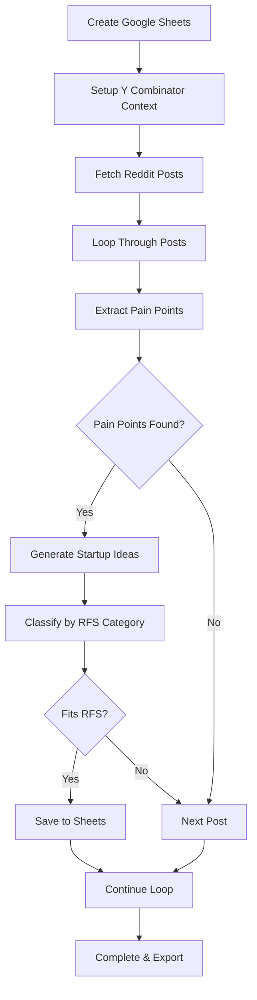

# AI Startup Idea Generator

> Automatically mine Reddit for real user pain points and generate Y Combinator-worthy startup concepts using AI

## 📋 Overview

This n8n automation workflow solves one of entrepreneurship's biggest challenges: finding real problems worth solving. Instead of brainstorming in isolation, this system systematically discovers genuine user pain points from Reddit conversations and transforms them into fundable startup concepts using cutting-edge AI technologies.

## 🎯 What This Solves

- **Problem Discovery**: Automatically identifies real user pain points from authentic conversations
- **Idea Generation**: Creates startup concepts using latest AI technologies (RAG, multimodal AI, agents)
- **Market Validation**: Sources ideas from actual user discussions, not assumptions
- **Investor Alignment**: Generates concepts matching Y Combinator's Request for Startups (RFS) categories

## ⚡ Key Features

- **Reddit Data Mining**: Scrapes posts from multiple subreddits for pain point discovery
- **AI Pain Point Analysis**: Uses advanced prompting to identify genuine problems
- **Technology Integration**: Augments ideas with investor-friendly AI technologies
- **Structured Reasoning**: Employs JSON-based reasoning for higher creativity and accuracy
- **RFS Classification**: Automatically categorizes ideas by Y Combinator funding priorities
- **Google Sheets Export**: Organizes all results in clean, accessible format

## 🚀 Results

- **95% Time Reduction**: Generate 50+ validated concepts in 10 minutes vs months of manual research
- **Market-Backed Ideas**: Every concept sourced from real user conversations
- **Investor-Ready**: Ideas incorporate technologies that VCs actively fund
- **Zero Guesswork**: Systematic approach eliminates idea paralysis

## 🛠️ Technical Stack

- **Platform**: n8n (No-code automation)
- **Data Source**: Reddit API
- **AI Engine**: Large Language Models (GPT-4 recommended)
- **Storage**: Google Sheets
- **Processing**: Advanced prompting techniques (Chain-of-Thought, Structured Reasoning)

## 📦 Installation

### Prerequisites
- n8n instance (local or cloud)
- Google account with Sheets API access
- Reddit API credentials
- Access to LLM (OpenAI, Anthropic, or local model)

### Setup Steps

1. **Download Workflow**
   ```bash
   # Download the workflow file from the description
   # Import into your n8n instance
   ```

2. **Configure Google Sheets**
   - Open both Google Sheets nodes
   - Connect your Google account
   - Select target spreadsheet

3. **Setup Reddit API**
   - Create Reddit app at https://www.reddit.com/prefs/apps
   - Select "web app" type
   - Copy client ID and secret to n8n credentials
   - Use provided redirect URL

4. **Configure LLM**
   - Select your preferred language model
   - Connect API credentials
   - Ensure multimodal capabilities for best results

5. **Customize Parameters**
   - Edit number of posts to analyze
   - Select target subreddits
   - Choose RFS categories to focus on

## 🔄 Workflow Process



## 📊 Output Format

The workflow generates a structured Google Sheet with:

| Column | Description | Example |
|--------|-------------|---------|
| RFS Category | Y Combinator focus area | "AI-Powered Tools" |
| Pain Point | Identified user problem | "Manual data entry is time-consuming" |
| Startup Idea | Generated solution concept | "AI-powered document processing agent" |
| Technology Stack | Suggested implementation | "RAG + Computer Vision + NLP" |
| Target Market | Potential customers | "Legal firms, accounting agencies" |
| Validation Notes | Research suggestions | "Interview 10 law firm partners" |

## 🎛️ Configuration Options

### Reddit Settings
- **Subreddits**: Target communities (r/entrepreneur, r/smallbusiness, etc.)
- **Post Limit**: Number of posts to analyze per run
- **Time Filter**: Recent posts vs historical data

### AI Processing
- **Model Selection**: GPT-4, Claude, or local alternatives
- **Temperature**: Creativity vs consistency balance
- **Context Window**: Amount of Reddit post context to analyze

### RFS Categories
- AI and Machine Learning
- Climate and Sustainability  
- Healthcare and Biotech
- Fintech and Financial Services
- Developer Tools
- Enterprise Software

## 💡 Usage Tips

### Best Practices
1. **Target Active Subreddits**: Focus on communities with genuine business discussions
2. **Regular Runs**: Execute weekly to catch emerging trends
3. **Validate Everything**: Use "The Mom Test" principles for idea validation
4. **Iterate Prompts**: Refine AI instructions based on output quality

### Recommended Subreddits
- r/entrepreneur
- r/smallbusiness
- r/startups
- r/SaaS
- r/nocode
- Industry-specific communities

## 🔧 Troubleshooting

### Common Issues

**Reddit API Rate Limits**
- Implement delays between requests
- Use pagination for large data sets
- Monitor API usage quotas

**LLM Context Limits**
- Chunk large Reddit posts
- Prioritize recent, high-engagement content
- Use summarization for lengthy discussions

**Google Sheets Permissions**
- Ensure proper API access
- Check sharing permissions
- Verify sheet structure matches workflow expectations

## 📈 Optimization

### Performance Improvements
- **Parallel Processing**: Run multiple subreddit analyses simultaneously
- **Caching**: Store frequently accessed data locally
- **Smart Filtering**: Pre-filter posts by engagement metrics

### Quality Enhancements
- **Multi-Model Validation**: Use different LLMs to cross-verify ideas
- **Sentiment Analysis**: Prioritize posts with strong emotional signals
- **Trend Analysis**: Weight ideas by discussion volume and recency

## 🤝 Contributing

This workflow is part of the Novus AI automation toolkit. For enhancements:

1. Fork the workflow
2. Test improvements thoroughly
3. Document changes clearly
4. Submit pull request with examples

## 📚 Resources

- **The Mom Test**: Essential reading for idea validation
- **Y Combinator RFS**: Latest startup categories YC wants to fund
- **n8n Documentation**: Workflow automation best practices
- **Reddit API Docs**: Data access and rate limiting guidelines

## 🆘 Support

- **Community**: Join our no-code AI community on School
- **Premium Workflows**: Advanced templates for validated members
- **Direct Support**: Reach out for custom automation needs

## 📄 License

This workflow is provided as-is for educational and business use. Customize freely for your startup discovery needs.

## 🎯 Next Steps

1. **Run Your First Analysis**: Start with 3-5 relevant subreddits
2. **Review Generated Ideas**: Look for recurring themes and strong pain points
3. **Begin Validation**: Contact potential customers using "The Mom Test" framework
4. **Iterate and Improve**: Refine prompts based on idea quality
5. **Scale Discovery**: Expand to more communities and categories

---

*Built with ❤️ by the Novus AI Automation team. Turn problems into opportunities, systematically.*
